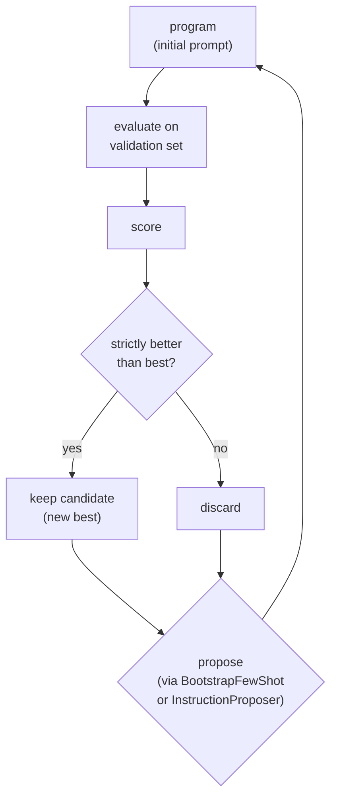
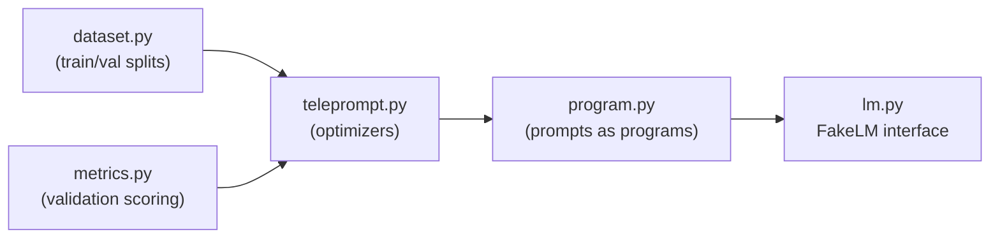

# DSPy prompt optimization: architecture

## Optimization loop (teleprompter)

```mermaid
flowchart TD
    P0["program\n(initial prompt)"] --> E["evaluate on\nvalidation set"]
    E --> SC["score"]
    SC --> T{"strictly better\nthan best?"}
    T -->|"yes"| K["keep candidate\n(new best)"]
    T -->|"no"| D["discard"]
    K --> M{"propose\n(via BootstrapFewShot\nor InstructionProposer)"}
    D --> M
    M --> P0
```

Monotonic by construction: nothing is kept unless it strictly improves.

## Component map

```mermaid
flowchart LR
    PR["program.py\n(prompts as programs)"] --> LM["lm.py\nFakeLM interface"]
    TP["teleprompt.py\n(optimizers)"] --> PR
    DS["dataset.py\n(train/val splits)"] --> TP
    MT["metrics.py\n(validation scoring)"] --> TP
```
